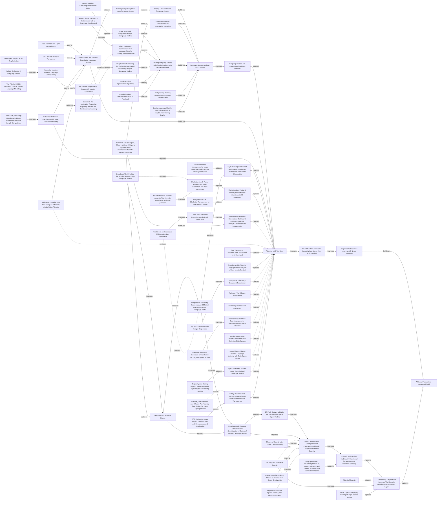

# 论文关系图

> 此文件由 `llm-course papers graph` 生成。箭头从新工作指向它依赖或改进的工作。

```mermaid
flowchart LR
  bengio_nplm["A Neural Probabilistic Language Model"]
  seq2seq["Sequence to Sequence Learning with Neural Networks"]
  bahdanau_attention["Neural Machine Translation by Jointly Learning to Align and Translate"]
  transformer["Attention Is All You Need"]
  gpt2["Language Models are Unsupervised Multitask Learners"]
  gpt3["Language Models are Few-Shot Learners"]
  scaling_laws["Scaling Laws for Neural Language Models"]
  chinchilla["Training Compute-Optimal Large Language Models"]
  llama["LLaMA: Open and Efficient Foundation Language Models"]
  adamw["Decoupled Weight Decay Regularization"]
  rmsnorm["Root Mean Square Layer Normalization"]
  swiglu["GLU Variants Improve Transformer"]
  rope["RoFormer: Enhanced Transformer with Rotary Position Embedding"]
  gqa["GQA: Training Generalized Multi-Query Transformer Models from Multi-Head Checkpoints"]
  flashattention["FlashAttention: Fast and Memory-Efficient Exact Attention with IO-Awareness"]
  flashattention2["FlashAttention-2: Faster Attention with Better Parallelism and Work Partitioning"]
  pagedattention["Efficient Memory Management for Large Language Model Serving with PagedAttention"]
  speculative_decoding["Fast Inference from Transformers via Speculative Decoding"]
  sparsely_gated_moe["Outrageously Large Neural Networks: The Sparsely-Gated Mixture-of-Experts Layer"]
  gshard["GShard: Scaling Giant Models with Conditional Computation and Automatic Sharding"]
  switch_transformer["Switch Transformers: Scaling to Trillion Parameter Models with Simple and Efficient Sparsity"]
  st_moe["ST-MoE: Designing Stable and Transferable Sparse Expert Models"]
  instructgpt["Training Language Models to Follow Instructions with Human Feedback"]
  lora["LoRA: Low-Rank Adaptation of Large Language Models"]
  dpo["Direct Preference Optimization: Your Language Model is Secretly a Reward Model"]
  qlora["QLoRA: Efficient Finetuning of Quantized LLMs"]
  deepseekmoe["DeepSeekMoE: Towards Ultimate Expert Specialization in Mixture-of-Experts Language Models"]
  deepseek_v2["DeepSeek-V2: A Strong, Economical, and Efficient Mixture-of-Experts Language Model"]
  mixtral["Mixtral of Experts"]
  mamba2["Transformers are SSMs: Generalized Models and Efficient Algorithms Through Structured State Space Duality"]
  gated_deltanet["Gated Delta Networks: Improving Mamba2 with Delta Rule"]
  deepseekmath["DeepSeekMath: Pushing the Limits of Mathematical Reasoning in Open Language Models"]
  deepseek_r1["DeepSeek-R1: Incentivizing Reasoning Capability in LLMs via Reinforcement Learning"]
  deepseek_v3["DeepSeek-V3 Technical Report"]
  minimax_m1["MiniMax-M1: Scaling Test-Time Compute Efficiently with Lightning Attention"]
  kimi_linear["Kimi Linear: An Expressive, Efficient Attention Architecture"]
  deepseek_v32["DeepSeek-V3.2: Pushing the Frontier of Open Large Language Models"]
  nemotron3_super["Nemotron 3 Super: Open, Efficient Mixture-of-Experts Hybrid Mamba-Transformer Model for Agentic Reasoning"]
  routing_free_moe["Routing-Free Mixture-of-Experts"]
  mqa["Fast Transformer Decoding: One Write-Head is All You Need"]
  transformer_xl["Transformer-XL: Attentive Language Models Beyond a Fixed-Length Context"]
  alibi["Train Short, Test Long: Attention with Linear Biases Enables Input Length Extrapolation"]
  longformer["Longformer: The Long-Document Transformer"]
  bigbird["Big Bird: Transformers for Longer Sequences"]
  reformer["Reformer: The Efficient Transformer"]
  performer["Rethinking Attention with Performers"]
  linear_transformer["Transformers are RNNs: Fast Autoregressive Transformers with Linear Attention"]
  retnet["Retentive Network: A Successor to Transformer for Large Language Models"]
  mamba["Mamba: Linear-Time Sequence Modeling with Selective State Spaces"]
  h3["Hungry Hungry Hippos: Towards Language Modeling with State Space Models"]
  hyena["Hyena Hierarchy: Towards Larger Convolutional Language Models"]
  flashattention3["FlashAttention-3: Fast and Accurate Attention with Asynchrony and Low-precision"]
  ring_attention["Ring Attention with Blockwise Transformers for Near-Infinite Context"]
  stripedhyena["StripedHyena: Moving Beyond Transformers with Hybrid Signal Processing Models"]
  base_layers["BASE Layers: Simplifying Training of Large, Sparse Models"]
  expert_choice["Mixture-of-Experts with Expert Choice Routing"]
  sparse_upcycling["Sparse Upcycling: Training Mixture-of-Experts from Dense Checkpoints"]
  megablocks["MegaBlocks: Efficient Sparse Training with Mixture-of-Experts"]
  deepspeed_moe["DeepSpeed-MoE: Advancing Mixture-of-Experts Inference and Training to Power Next-Generation AI Scale"]
  dedup_training_data["Deduplicating Training Data Makes Language Models Better"]
  the_pile["The Pile: An 800GB Dataset of Diverse Text for Language Modeling"]
  gopher["Scaling Language Models: Methods, Analysis & Insights from Training Gopher"]
  mmlu["Measuring Massive Multitask Language Understanding"]
  helm["Holistic Evaluation of Language Models"]
  ppo["Proximal Policy Optimization Algorithms"]
  constitutional_ai["Constitutional AI: Harmlessness from AI Feedback"]
  simpo["SimPO: Simple Preference Optimization with a Reference-Free Reward"]
  kto["KTO: Model Alignment as Prospect Theoretic Optimization"]
  gptq["GPTQ: Accurate Post-Training Quantization for Generative Pre-trained Transformers"]
  smoothquant["SmoothQuant: Accurate and Efficient Post-Training Quantization for Large Language Models"]
  awq["AWQ: Activation-aware Weight Quantization for LLM Compression and Acceleration"]
  seq2seq -->|builds on| bengio_nplm
  bahdanau_attention -->|improves| seq2seq
  transformer -->|improves| bahdanau_attention
  gpt2 -->|builds on| transformer
  gpt3 -->|improves| gpt2
  scaling_laws -->|builds on| gpt3
  chinchilla -->|improves| scaling_laws
  llama -->|builds on| chinchilla
  llama -->|builds on| transformer
  rmsnorm -->|used by| llama
  swiglu -->|used by| llama
  rope -->|improves| transformer
  rope -->|used by| llama
  gqa -->|improves| transformer
  flashattention -->|improves| transformer
  flashattention2 -->|improves| flashattention
  pagedattention -->|builds on| gqa
  speculative_decoding -->|improves| gpt3
  sparsely_gated_moe -->|builds on| bengio_nplm
  gshard -->|improves| sparsely_gated_moe
  switch_transformer -->|improves| gshard
  st_moe -->|improves| switch_transformer
  instructgpt -->|builds on| gpt3
  lora -->|improves| instructgpt
  dpo -->|improves| instructgpt
  qlora -->|improves| lora
  deepseekmoe -->|improves| switch_transformer
  deepseekmoe -->|builds on| st_moe
  deepseek_v2 -->|improves| deepseekmoe
  deepseek_v2 -->|improves| gqa
  mixtral -->|builds on| sparsely_gated_moe
  mamba2 -.->|contrasts| transformer
  gated_deltanet -->|improves| mamba2
  deepseekmath -->|builds on| instructgpt
  deepseek_r1 -->|improves| deepseekmath
  deepseek_v3 -->|improves| deepseek_v2
  deepseek_v3 -->|improves| deepseekmoe
  minimax_m1 -.->|contrasts| transformer
  minimax_m1 -->|builds on| deepseek_r1
  kimi_linear -->|improves| gated_deltanet
  kimi_linear -.->|contrasts| deepseek_v2
  deepseek_v32 -->|improves| deepseek_v3
  deepseek_v32 -.->|contrasts| flashattention2
  nemotron3_super -->|builds on| mamba2
  nemotron3_super -->|builds on| deepseek_v3
  nemotron3_super -->|builds on| speculative_decoding
  routing_free_moe -.->|contrasts| switch_transformer
  routing_free_moe -->|improves| sparsely_gated_moe
  mqa -->|improves| transformer
  transformer_xl -->|improves| transformer
  alibi -.->|contrasts| rope
  longformer -.->|contrasts| transformer
  bigbird -->|improves| longformer
  reformer -.->|contrasts| transformer
  performer -.->|contrasts| transformer
  linear_transformer -.->|contrasts| transformer
  retnet -->|improves| linear_transformer
  mamba -.->|contrasts| transformer
  h3 -.->|contrasts| transformer
  hyena -.->|contrasts| transformer
  flashattention3 -->|improves| flashattention2
  ring_attention -->|builds on| flashattention
  stripedhyena -->|builds on| hyena
  base_layers -->|improves| sparsely_gated_moe
  expert_choice -.->|contrasts| switch_transformer
  sparse_upcycling -->|builds on| switch_transformer
  megablocks -->|improves| switch_transformer
  deepspeed_moe -->|builds on| gshard
  dedup_training_data -->|builds on| gpt3
  gopher -->|improves| gpt3
  mmlu -->|used by| llama
  helm -.->|contrasts| mmlu
  ppo -->|used by| instructgpt
  constitutional_ai -->|improves| instructgpt
  simpo -->|improves| dpo
  kto -.->|contrasts| dpo
  gptq -->|builds on| transformer
  smoothquant -.->|contrasts| gptq
  awq -->|improves| gptq
```
